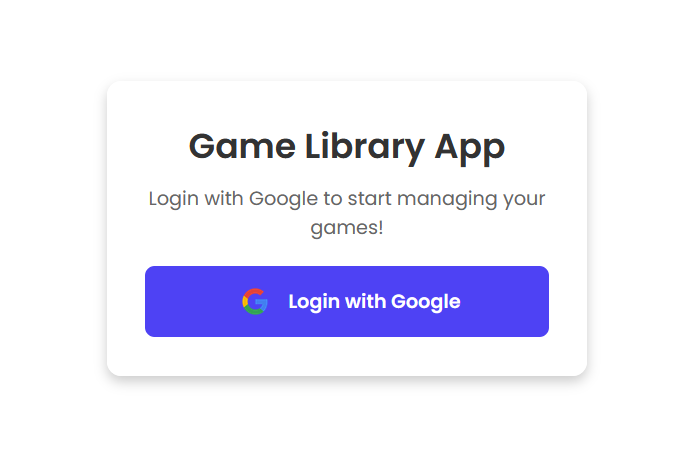
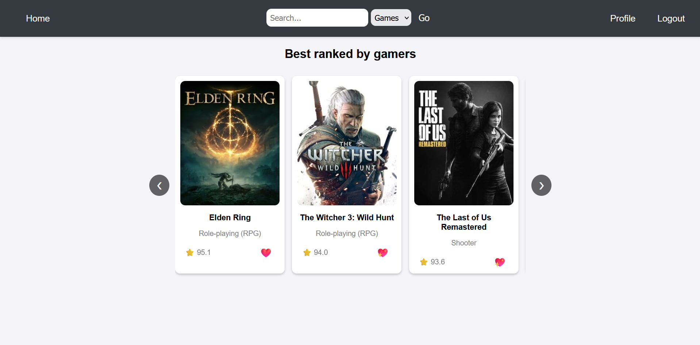
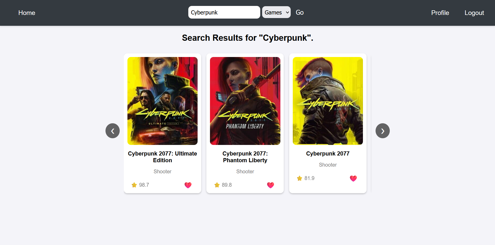
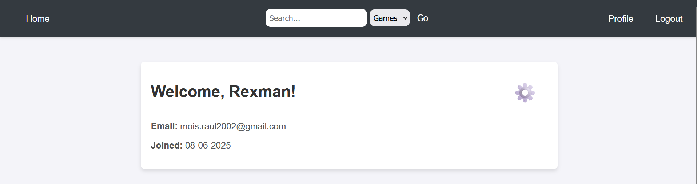
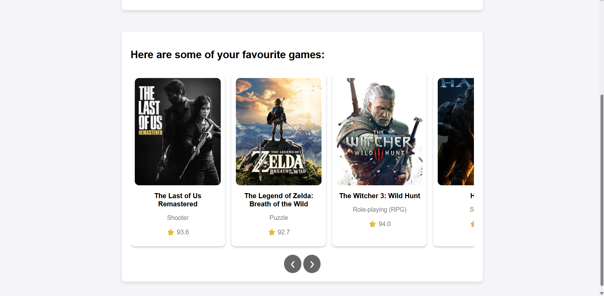
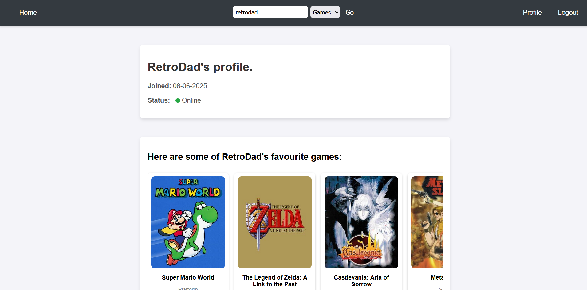

# GameConnect

**GameConnect** is a Flask-based web application that combines game discovery with social features. It leverages the IGDB API to provide accurate game data, integrates Google OAuth for secure authentication, and stores user data in MongoDB. Users can search for games, manage favorites, view other profiles, and see who is online in real time using websocket-based presence detection.

---

## Overview

GameConnect is designed for gamers who want to:

- Search for games and view their metadata, including ratings and cover art.
- Save and manage their favorite games.
- Discover what other users are playing or interested in.
- See whether users are online before interacting with their profiles.
- Enjoy a clean, intuitive interface with real-time elements.

**Live App**: [https://game-lib-app.onrender.com/](https://game-lib-app.onrender.com/)

---

## Technical Stack

| Layer        | Technology                          |
|--------------|--------------------------------------|
| Backend      | Flask, Flask-SocketIO                |
| Frontend     | HTML, CSS, Jinja2, JavaScript        |
| Auth         | Flask-Dance (Google OAuth)           |
| Game API     | IGDB (via Twitch Developer credentials) |
| Database     | MongoDB (for user and favorites data) |
| WebSockets   | Flask-SocketIO (real-time presence)  |
| Deployment   | Render.com                           |

---

## Features

### 1. Google OAuth Authentication

- Secure sign-in using Google accounts.
- New users are automatically registered on first login.
- Minimal login screen with a single button for authentication.

---

### 2. Game Discovery via IGDB

- Game search powered by IGDB API with relevant titles, cover images, and user ratings.
- Add games to your personal favorites list.
- Clean result display with IGDB integration.
- A Home page that displays currently top-ranked games (more to come) for you to discover.

---

### 3. Favorites and User Profiles

- Each user has a profile that lists their liked games.
- You can change the initially generated username via the settings button.
- Responsive layout to manage your favorites and profile settings.

---

### 4. Social Discovery and Real-Time Presence

- Search for other users by name.
- View their liked games and live online/offline status via WebSockets.
- Toggle in the search bar to switch between game and user search modes.

---

## Application Structure

- **Login Page** – Minimal Google sign-in interface.
- **Home Page** – Displays top-ranked games.
- **Profile Page** – Shows your liked games and username (editable).
- **Game Results Page** – Displays search results from IGDB.
- **User Profiles** – Displays another user's liked games and real-time presence.

---

## Future Improvements
- Direct messaging or chat between users.

- Filtering and sorting by game genres, platforms, etc.

- Ability to track game progression and user reviews.

- More feature-rich home page.

